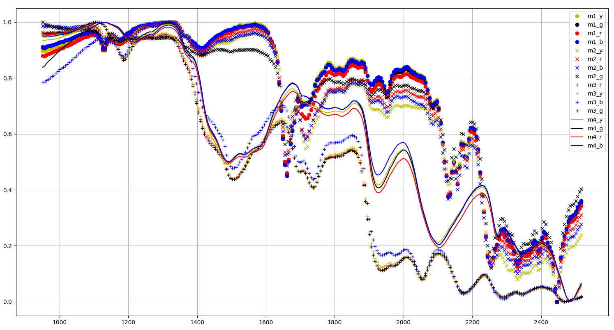
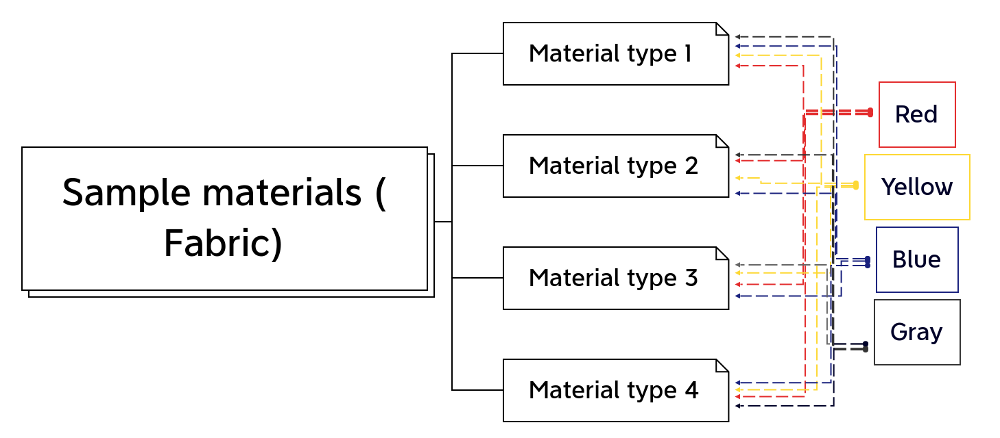
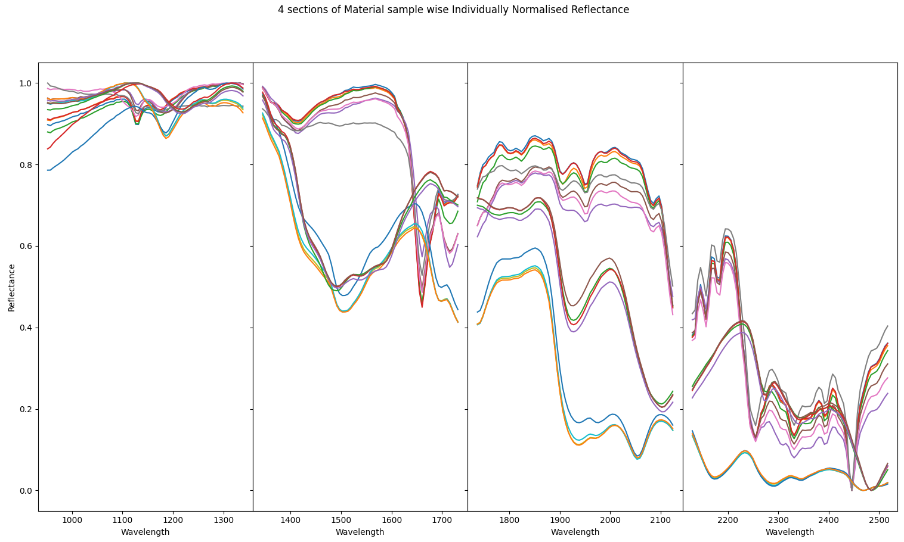
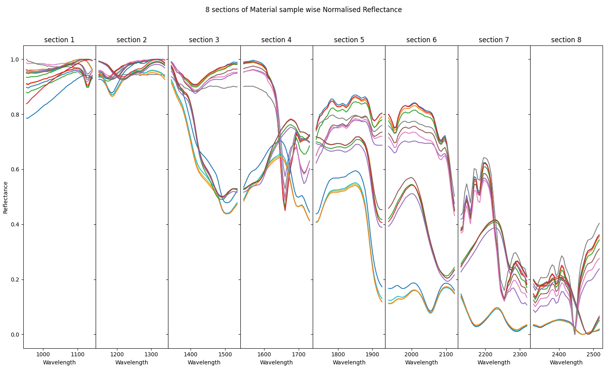
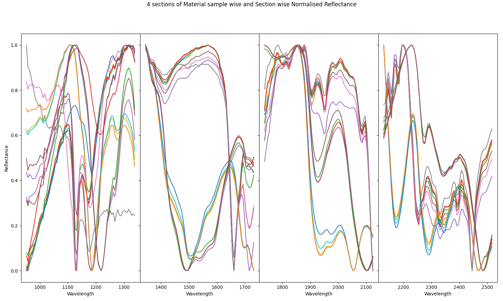
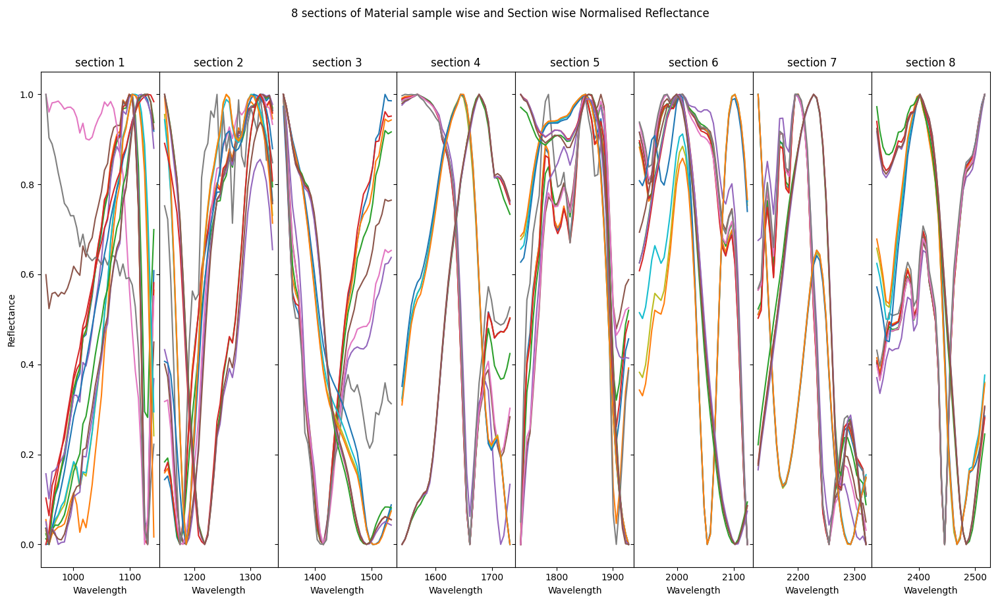
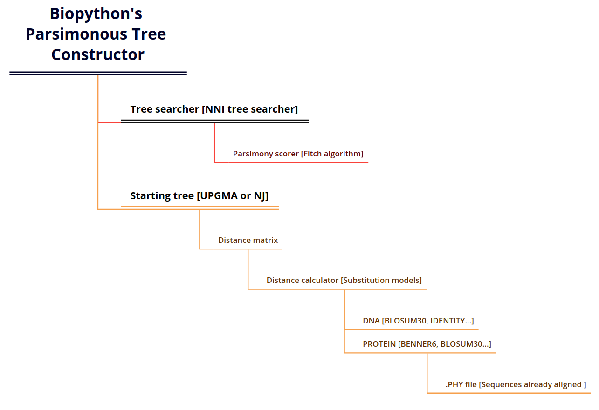
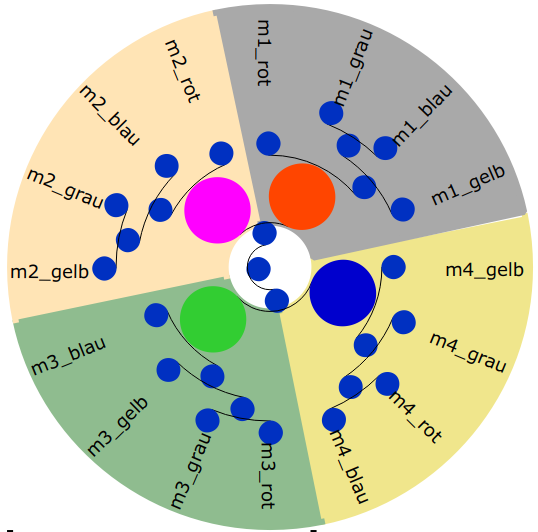
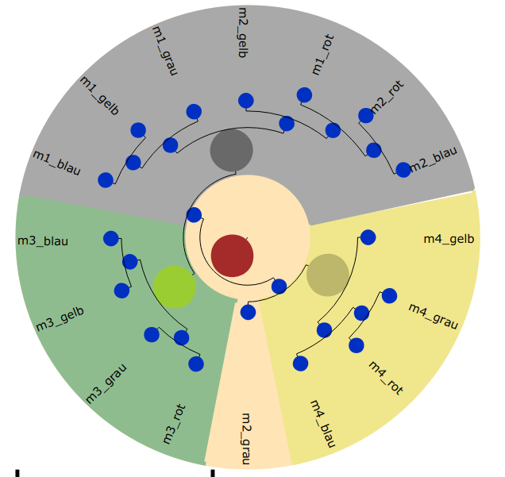
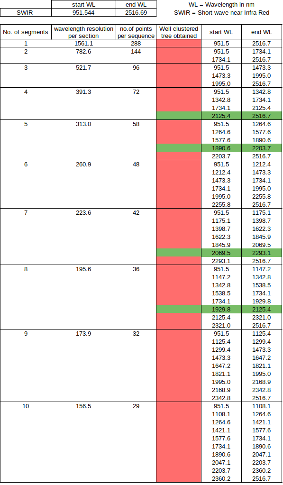

# Time invariant Product features identification through Phylogenetic approach

## Short description of the project:
The aim of the research is to perform feasibility research on the possibility of using Phylogenetic algorithms which are used in the field of Biology and Biotechnology to identify the relationships between organisms and species. The area of application at hand is to identify a way to utilise only set of surface features like surface reflectance property of a product/an object that can be used to Uniquelyand reliably identify and distinguish a product/object.

*Visualisation of the reflectance behavior of 16 types of fabric materials with respect to incident light of varying frequency*

*Sample materials and their types*

*Sub division of reflectance behaviour into 4 equal sized ranges of light wavelength*

*Sub division of reflectance behaviour into 8 equal sized ranges of light wavelength*

*4 Individual slices are normalised for better representation of numerical values into alphabetical sequences*

*8 Individual slices are normalised for better representation of numerical values into alphabetical sequences*

*Pipeline of Maximum Parsimony algorithm*

*Visualisation of an accurately clustered tree*

*Visualisation of an inaccurately clustered tree*

*Sections of reflectance behaviour that yielded in  a well clustered trees are highlighted in green.*

## code

Python code files which were used for generating Phylogenetic trees.

## data_collection

Information regarding the instruments, samples and the collected experiment data

## initial approaches

Initial approaches explored prior to Phylogenetic approach and files associated with them.

## literature

A collection of literature used and explored during the research of this Feasibility study

## Phylogenetic approach

Images, literature and phylogenetic trees generated during the study

## Time invariant Product features identification through Phylogenetic approach REPORT.pdf

Report of this study
